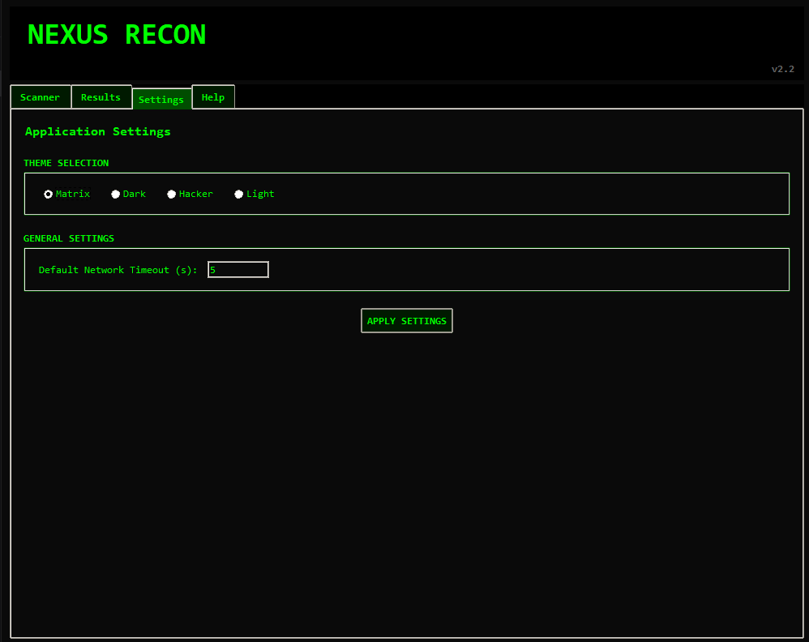

<div align="center">
  <h1>🔍 Nexus Recon</h1>
  <h3>Advanced Network Reconnaissance & Security Assessment Toolkit</h3>
  
  [](https://opensource.org/licenses/MIT)
  [](https://www.python.org/downloads/)
  [](CONTRIBUTING.md)
  [](https://github.com/ChickenWithACrown/nexus-recon/stargazers)
  [](https://github.com/ChickenWithACrown/nexus-recon/network/members)
  
  *A comprehensive security toolkit for penetration testers and security researchers*
</div>

## 🚀 Overview

Nexus Recon is a powerful, all-in-one network reconnaissance and security assessment toolkit designed for cybersecurity professionals and ethical hackers. With its intuitive GUI, Nexus Recon streamlines the process of network scanning, vulnerability assessment, and security auditing.

**Disclaimer**: This tool is intended for security testing and educational purposes only. Use only on systems you own or have explicit permission to test. The developers are not responsible for any misuse or damage caused by this software.

## 🛠️ Features

### 🔍 Reconnaissance
- **Port Scanning**: Comprehensive port scanning with service detection
- **WHOIS Lookup**: Detailed domain and IP registration information
- **DNS Lookup**: Advanced DNS record analysis and enumeration
- **Subdomain Enumeration**: Discover subdomains using multiple techniques
- **IP Geolocation**: Pinpoint physical locations of IP addresses

### 🔒 Security Testing
- **Vulnerability Scanning**: Automated detection of common vulnerabilities
- **SQL Injection Testing**: Advanced SQLi detection with multiple payloads
- **XSS Testing**: Cross-Site Scripting vulnerability detection
- **HTTP Headers Analysis**: Security header inspection and recommendations
- **SSL/TLS Analysis**: Certificate and encryption strength testing

### 📊 Reporting
- Detailed scan reports with severity levels
- Exportable results in multiple formats
- Visual representation of network topology
- Vulnerability classification and remediation advice

## ⚙️ System Requirements

- **OS**: Windows 10/11, Linux, macOS
- **Python**: 3.8 or higher
- **RAM**: 4GB minimum (8GB recommended)
- **Disk Space**: 500MB free space
- **Network**: Stable internet connection for updates and lookups

## 📦 Dependencies

Core dependencies are listed in `requirements.txt`. Install them using:

## 🚀 Installation

### Method 1: From Source (Recommended for Developers)
```bash
# Clone the repository
git clone https://github.com/ChickenWithACrown/nexus-recon.git
cd nexus-recon

# Create and activate virtual environment (recommended)
python -m venv venv
.\venv\Scripts\activate  # Windows
source venv/bin/activate  # Linux/Mac

# Install dependencies
pip install -r requirements.txt
```

### Method 2: Using pip (Coming Soon)
```bash
pip install nexus-recon
```

### Method 3: Standalone Executable (Coming Soon)
Download the latest release from the [Releases](https://github.com/ChickenWithACrown/nexus-recon/releases) page.

## 🖥️ Usage

### Starting the Application
Simply double-click on `NexusRecon.exe` to launch the application. The GUI will guide you through all available features.

### GUI Features
- **Target Input**: Enter the target IP, domain, or URL
- **Scan Selection**: Choose from various scan types
- **Results Panel**: View scan results in real-time
- **Export Options**: Save your scan results
- **Settings**: Configure application preferences

### System Tray
NexusRecon runs in the system tray when minimized, allowing you to quickly access it without cluttering your taskbar.

### Installation Methods

#### Method 1: Using the Executable (Recommended)
1. Download the latest release from the [Releases](https://github.com/ChickenWithACrown/nexus-recon/releases) page
2. Extract the downloaded ZIP file
3. Double-click on `NexusRecon.exe` to launch the application

#### Method 2: From Source
```bash
# Clone the repository
git clone https://github.com/ChickenWithACrown/nexus-recon.git
cd nexus-recon

# Install dependencies
pip install -r requirements.txt

# Run the application
python netrecon.py
```

## 📸 Screenshots

### Dashboard View 1


### Dashboard View 2


### Help Section


### Scan Results


### Settings Panel


## 💖 Support My Work

If you find this project useful and would like to support its development, please consider checking out my support page:

🔗 [Support Me](https://crown.great-site.net/)

Your support helps me continue to develop and maintain this project and create more open-source tools.

## 🤝 Contributing

We welcome contributions from the community! Before contributing, please read our [Contributing Guidelines](CONTRIBUTING.md).

1. Fork the repository
2. Create your feature branch (`git checkout -b feature/AmazingFeature`)
3. Commit your changes (`git commit -m 'Add some AmazingFeature'`)
4. Push to the branch (`git push origin feature/AmazingFeature`)
5. Open a Pull Request

## 📜 License

Distributed under the MIT License. See `LICENSE` for more information.

## 👥 Community & Support

- **Discord**: Join our [Discord Server](https://discord.gg/2ZuJDpDtsx) for support and discussions
- **GitHub Issues**: [Report Issues & Feature Requests](https://github.com/ChickenWithACrown/nexus-recon/issues)
- **Contribute**: Check out our [Contributing Guide](CONTRIBUTING.md)

For security-related issues, please see our [Security Policy](SECURITY.md).

## 🙏 Acknowledgments

- Thanks to all contributors who have helped improve Nexus Recon
- Inspired by various open-source security tools
- Built with ❤️ by the cybersecurity community

## ⚠️ Legal Notice

**Nexus Recon** is intended for **legal security testing and educational purposes only**. The developers and contributors are not responsible for any misuse or damage caused by this program. By using this software, you agree to the following:

- You will only test systems you own or have explicit permission to test
- You will comply with all applicable laws and regulations
- You take full responsibility for your actions

Always ensure you have proper authorization before performing any security testing.
